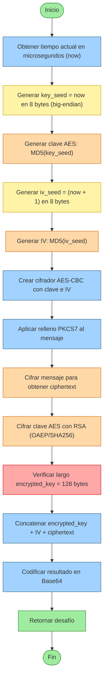
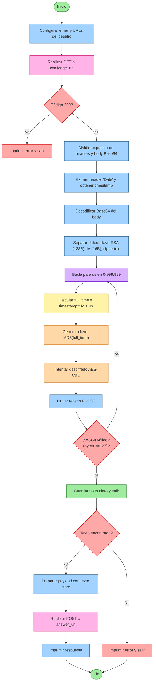

# Desafio

```mermaid
flowchart TD
    A([Inicio]):::green --> B["Obtener tiempo actual en microsegundos (now)"]:::blue
    B --> C["Generar key_seed = now en 8 bytes (big-endian)"]:::yellow
    C --> D["Generar clave AES: MD5(key_seed)"]:::orange
    D --> E["Generar iv_seed = (now + 1) en 8 bytes"]:::yellow
    E --> F["Generar IV: MD5(iv_seed)"]:::orange
    F --> G["Crear cifrador AES-CBC con clave e IV"]:::blue
    G --> H["Aplicar relleno PKCS7 al mensaje"]:::blue
    H --> I["Cifrar mensaje para obtener ciphertext"]:::orange
    I --> J["Cifrar clave AES con RSA (OAEP/SHA256)"]:::orange
    J --> K["Verificar largo encrypted_key = 128 bytes"]:::red
    K --> L["Concatenar encrypted_key + IV + ciphertext"]:::blue
    L --> M["Codificar resultado en Base64"]:::blue
    M --> N["Retornar desafío"]:::green
    N --> O([Fin]):::green

    classDef green fill:#9feb9f,stroke:#2a7f2a
    classDef blue fill:#a2d2ff,stroke:#2a5c7f
    classDef orange fill:#ffd8a8,stroke:#cc6600
    classDef yellow fill:#fff3a8,stroke:#cc9c00
    classDef red fill:#ffa8a8,stroke:#cc0000
```
# Solucion

```mermaid
flowchart TD
    A([Inicio]):::green --> B["Configurar email y URLs del desafío"]:::blue
    B --> C["Realizar GET a challenge_url"]:::pink
    C --> D{Código 200?}:::red
    D -- No --> E["Imprimir error y salir"]:::red
    D -- Sí --> F["Dividir respuesta en headers y body Base64"]:::blue
    F --> G["Extraer header 'Date' y obtener timestamp"]:::blue
    G --> H["Decodificar Base64 del body"]:::blue
    H --> I["Separar datos: clave RSA (128B), IV (16B), ciphertext"]:::blue
    I --> J["Bucle para us en 0-999,999"]:::purple
    J --> K["Calcular full_time = timestamp*1M + us"]:::yellow
    K --> L["Generar clave: MD5(full_time)"]:::orange
    L --> M["Intentar descifrado AES-CBC"]:::orange
    M --> N["Quitar relleno PKCS7"]:::blue
    N --> O{"¿ASCII válido?\n(bytes <=127)?"}:::red
    O -- No --> J
    O -- Sí --> P["Guardar texto claro y salir"]:::green
    P --> Q{"Texto encontrado?"}:::red
    Q -- No --> R["Imprimir error y salir"]:::red
    Q -- Sí --> S["Preparar payload con texto claro"]:::blue
    S --> T["Realizar POST a answer_url"]:::pink
    T --> U["Imprimir respuesta"]:::blue
    U --> V([Fin]):::green
    R --> V

    classDef green fill:#9feb9f,stroke:#2a7f2a
    classDef blue fill:#a2d2ff,stroke:#2a5c7f
    classDef orange fill:#ffd8a8,stroke:#cc6600
    classDef yellow fill:#fff3a8,stroke:#cc9c00
    classDef red fill:#ffa8a8,stroke:#cc0000
    classDef pink fill:#ffb3e6,stroke:#cc0066
    classDef purple fill:#d9b3ff,stroke:#6600cc
```