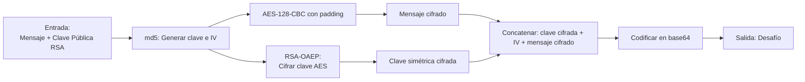
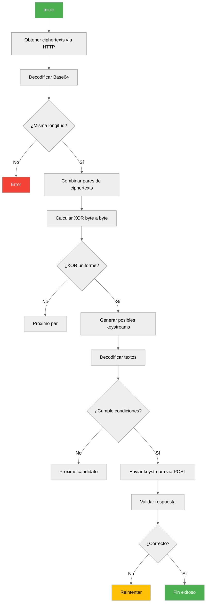

# Desafio:

```mermaid
flowchart LR
    Entrada[Entrada:\nMensaje + Clave Pública RSA] --> GenClave[md5: Generar clave e IV]
    GenClave --> AES[AES-128-CBC con padding]
    AES --> MsgCifrado[Mensaje cifrado]
    GenClave --> RSA[RSA-OAEP:\nCifrar clave AES]
    RSA --> ClaveCifrada[Clave simétrica cifrada]
    MsgCifrado --> Ensamblar[Concatenar: clave cifrada + IV + mensaje cifrado]
    ClaveCifrada --> Ensamblar
    Ensamblar --> Base64[Codificar en base64]
    Base64 --> Salida[Salida: Desafío]

```

# Solucion

```mermaid
%%{init: {'theme': 'neutral'}}%%
flowchart TD
    A[Inicio] --> B[Obtener ciphertexts vía HTTP]
    B --> C[Decodificar Base64]
    C --> D{¿Misma longitud?}
    D -->|No| E[Error]
    D -->|Sí| F[Combinar pares de ciphertexts]
    F --> G[Calcular XOR byte a byte]
    G --> H{¿XOR uniforme?}
    H -->|No| I[Próximo par]
    H -->|Sí| J[Generar posibles keystreams]
    J --> K[Decodificar textos]
    K --> L{¿Cumple condiciones?}
    L -->|No| M[Próximo candidato]
    L -->|Sí| N[Enviar keystream vía POST]
    N --> O[Validar respuesta]
    O --> P{¿Correcto?}
    P -->|No| Q[Reintentar]
    P -->|Sí| R[Fin exitoso]
    
    style A fill:#4CAF50,color:white
    style R fill:#4CAF50,color:white
    style E fill:#F44336,color:white
    style Q fill:#FFC107,color:black
    style H diamond
    style L diamond
    style P diamond
```